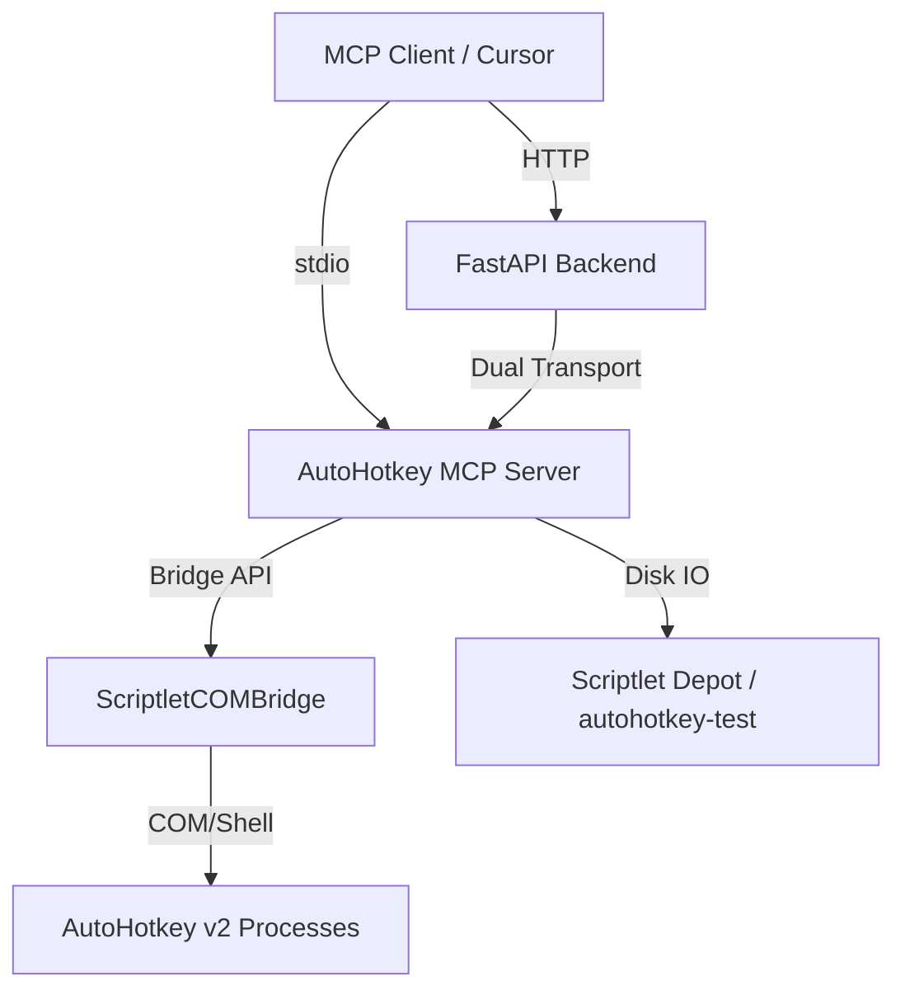

# Architecture: AutoHotkey MCP

## Overview

AutoHotkey MCP is a bridge between AI agents and the AutoHotkey (AHK) ecosystem on Windows. It enables agents to manage a "depot" of v2 scriptlets, orchestrate their execution, and generate new automation logic.

## System Components

### 1. The Depot (`autohotkey-test`)
A dedicated repository containing `.ahk` files organized by category. The MCP server reads metadata from headers (e.g., `@description`, `@hotkeys`) to present a structured catalog to the agent.

### 2. ScriptletCOMBridge
A lightweight C# or AHK-based middle-layer (running on port 10744) that provides stable process management and hotkey registration. The MCP server prefers using this bridge but can fallback to direct `AutoHotkey.exe` execution.

### 3. MCP Server (FastMCP 3.1)
The primary intelligence layer. It implements:
- **Dual Transport**: Supports both `stdio` (for IDEs) and `HTTP` (for the fleet dashboard).
- **Sampling**: Leverage's the agent's LLM to generate or refine AHK snippets safely.
- **Ontology**: Exposes its capabilities via a standardized `ontology.json` for fleet integration.

## Communication Protocols

- **Port 10746**: Backend API (FastAPI) and MCP HTTP transport.
- **Port 10747**: Frontend React SPA (Vite).
- **Port 10744**: Outbound to ScriptletCOMBridge.

## Safety & Sandboxing

- Generated scripts are written exclusively to `scriptlets/ai_generated/`.
- No scripts are executed automatically without user intervention or bridge confirmation.
- Direct execution uses restricted shell commands via `uv run`.
